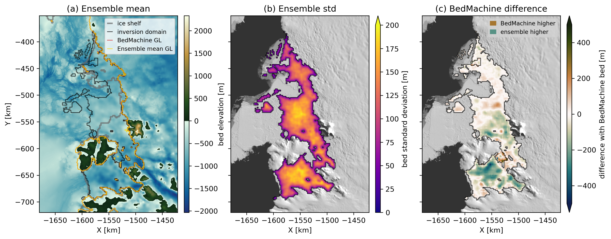

## Stochastic inversion of sub-ice-shelf bathymetry using airborne gravity data

Authors: Michael Field, Emma (Mickey) MacKie, Lijing Wang, Atsuhiro Muto, Niya Shao

### Overview

The shape of the seafloor below ice shelves in West Antarctica influences how quickly warm seawater will be able to melt ice shelves. Ice shelves play a critical role in stabilizing the West Antarctic Ice Sheet because they "hold back" the upstream ice. Thus, the shape of the seafloor, or bathymetry, below ice shelves is a critical uncertainty in ice sheet models and the sea level rise that they predict. Sub-ice-shelf bathymetry is hard to measure, and the best way to do it on large spatial scales is with airborne gravity measurements. Airborne gravity measurements detect small changes in the acceleration of gravity which reflect changes in the density distribution of the subsurface. The process of inferring the density distribution of the Earth from gravity data is called a gravity inversion. Gravity inversions are difficult problems because they are nonunique, meaning that there are many density distributions which can reproduce the gravity data, making uncertainty quantification very important. Previous bathymetry inversions (inverting gravity data for bathymetry) in the Amundsen Sea sector of Antarctica have lacked robust uncertainty quantification, particularly in regards to assumptions about the amount of gravity resulting from subsurface density variations. This project addresses this by stochastically simulating the Bouguer disturbance which reflects gravity due to subsurface density variations and crustal thickness. This stochastic simulation allows us to make many different versions of the terrain effect, or gravity due to the terrain. We then use a Random Walk Metropolis Markov Chain Monte Carlo inversion approach to invert for the bathymetry using different realizations of the terrain effect. The result is an ensemble of bathymetry models that captures the uncertainty due to subsurface density variations.

### Environment

In order to reproduce this work it is *highly* recommended you create a conda environment using the provided `environment.yml`. The environemnt can be created using:

`conda env create -f environment.yml`

The environment can then be activated with

`conda activate cryo`

### Usage

In order to reproduce the results in the (upcoming) paper:

1. Download data from the sources listed below and put them in `raw_data/`
2. Run `preprocessing.ipynb`. This notebook will preprocess BedMachine and gravity data to prepare it for doing inversions. Preprocessed datasets will be saved to `processed_data/`
3. Test out inversions in `single_inv.ipynb`. Inversions parameters, particularly the block update parameters, can be experimented with in this notebook.
4. To run an ensemble of inversions you can run `sgs_inversions.py` and `sgs_mean.py`. The former does an SGS simulation of the Bouger disturbance for each inversion while the latter uses the mean of the SGS simulations from `preprocessing.ipynb` for each inversion. `sgs_inversions.py` allows you to specify the number of inversions (-n), whether to dampen the change near the inversion boundary (-c), whether or not to sample background density (-d), whether or not to apply a lowpass filter to the Bouguer disturbance (-f), and at what RMSE to stop the inversion (-s). `sgs_mean.py` also allows you to specify the number of inversions (-n), whether to dampen the change near the inversion boundar (-c), and the stopping condition (-s). For both the output directory is specified with the -p argument.
5. After creating an ensemble of inversions the bathymetry models can be lowpass filtered to remove edge artifacts and upscaled to the original BedMachine resolution using `postprocessing.py`.
6. The figures from the paper and more can be reproduced by running `figures.iypnb` and `intro_fig.ipynb`.

**Note**: Following these steps and reproducing the 3 ensembles shown in the paper takes about 12-14 hours on a 11th Gen Intel(R) Core(TM) i7-11700 @ 2.50GHz with 64 GB RAM

### Data

This work uses a number of data sources:

* **Operation Ice Bridge gravity**, Accessible from: https://nsidc.org/icebridge/portal/map  
  Tinto, K., Bell, R. E. & Cochran, J. R. (2010). IceBridge Sander AIRGrav L1B Geolocated Free Air Gravity Anomalies. (IGGRV1B, Version 1). [Data Set]. Boulder, Colorado USA. NASA National Snow and Ice Data Center Distributed Active Archive Center. https://doi.org/10.5067/R1RQ6NRIJV89. Date Accessed 01-20-2025.
* **ITGC airborne gravity**  
  Jordan, T., Robinson, C., Porter, D., Locke, C., & Tinto, K. (2020). Processed line aerogravity data over the Thwaites Glacier region (2018/19 season) (Version 1.0) [Data set]. UK Polar Data Centre, Natural Environment Research Council, UK Research & Innovation. https://doi.org/10.5285/b9b28a35-8620-4182-bf9c-638800b6679b 
* **BedMachine Antarctica v3**  
  Morlighem, M. (2022). MEaSUREs BedMachine Antarctica. (NSIDC-0756, Version 3). [Data Set]. Boulder, Colorado USA. NASA National Snow and Ice Data Center Distributed Active Archive Center. https://doi.org/10.5067/FPSU0V1MWUB6. Date Accessed 01-20-2025.
* **MOA2014**  
  Haran, T., Klinger, M., Bohlander, J., Fahnestock, M., Painter, T. & Scambos, T. (2018). MEaSUREs MODIS Mosaic of Antarctica 2013-2014 (MOA2014) Image Map. (NSIDC-0730, Version 1). [Data Set]. Boulder, Colorado USA. NASA National Snow and Ice Data Center Distributed Active Archive Center. https://doi.org/10.5067/RNF17BP824UM. Date Accessed 01-20-2025.
* **Phase Velocity**  
  Mouginot, J., Rignot, E. & Scheuchl, B. (2019). MEaSUREs Phase-Based Antarctica Ice Velocity Map. (NSIDC-0754, Version 1). [Data Set]. Boulder, Colorado USA. NASA National Snow and Ice Data Center Distributed Active Archive Center. https://doi.org/10.5067/PZ3NJ5RXRH10. Date Accessed 01-20-2025.
* **Grounding Zone**  
  Rignot, E., Mouginot, J. & Scheuchl, B. (2023). MEaSUREs Grounding Zone of the Antarctic Ice Sheet. (NSIDC-0778, Version 1). [Data Set]. Boulder, Colorado USA. NASA National Snow and Ice Data Center Distributed Active Archive Center. https://doi.org/10.5067/HGLT8XB480E4. Date Accessed 01-20-2025.
* **Thwaites and Dotson seismic sounding**  
  Muto, A., Alley, K., Pettit, E. C., Pomraning, D., Roccaro, A., Scambos, T., et al. (2024) "Sub-ice-shelf seafloor elevation derived from point-source active-seismic data on Thwaites Eastern Ice Shelf and Dotson Ice Shelf, December 2019 and January 2020" U.S. Antarctic Program (USAP) Data Center. doi: https://doi.org/10.15784/601827.

### Software

* **Harmonica**  
  Fatiando a Terra Project, Castro, Y. M., Esteban, F. D., Li, L., Oliveira Jr, V. C., Pesce, A., Shea, N., Soler, S. R., Souza-Junior, G. F., Tankersley, M., Uieda, L., & Uppal, I. (2024). Harmonica v0.7.0: Forward modeling, inversion, and processing gravity and magnetic data (0.7.0). Zenodo. https://doi.org/10.5281/zenodo.13308312
* **Gradient Boosted Equivalent Sources (Harmonica)**  
  Santiago R Soler, Leonardo Uieda, Gradient-boosted equivalent sources, Geophysical Journal International, Volume 227, Issue 3, December 2021, Pages 1768–1783, https://doi.org/10.1093/gji/ggab297
* **Verde**  
  Uieda, L. (2018). Verde: Processing and gridding spatial data using Green’s functions. Journal of Open Source Software, 3(29), 957. doi:10.21105/joss.00957
* **SciKit Gstat**  
  Mirko Mälicke, Egil Möller, Helge David Schneider, & Sebastian Müller. (2021, May 28). mmaelicke/scikit-gstat: A scipy flavoured geostatistical variogram analysis toolbox (Version v0.6.0). Zenodo. http://doi.org/10.5281/zenodo.4835779
* **GSTools**  
  Sebastian Müller, & Lennart Schüler. (2023). GeoStat-Framework/GSTools: v1.5.0 'Nifty Neon' (v1.5.0). Zenodo. https://doi.org/10.5281/zenodo.8044720

